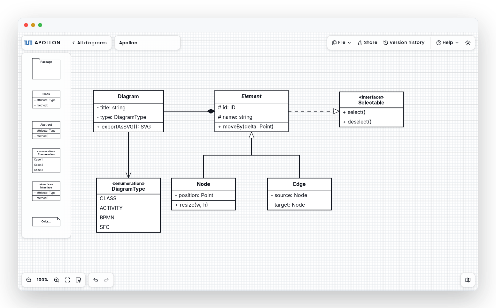

<div align="center">

<picture>
  <source media="(prefers-color-scheme: dark)" srcset="docs/static/img/apollon-lockup-dark.png" />
  
</picture>

[](https://www.npmjs.com/package/@tumaet/apollon)
[](https://www.npmjs.com/package/@tumaet/apollon)
[](./LICENSE)

**Open-source UML modeling editor for the web.** Draw 13 UML and modeling diagram types (class, component, activity, BPMN, SFC, and more) in the browser, collaborate in real time, and export to SVG, PNG, PDF, PPTX, or JSON.

<p>
  <a href="https://apollon.aet.cit.tum.de">
    <picture>
      <source media="(prefers-color-scheme: dark)" srcset="docs/static/img/apollon-btn-demo-dark.png" />
      
    </picture>
  </a>
  <a href="https://ls1intum.github.io/Apollon/">
    <picture>
      <source media="(prefers-color-scheme: dark)" srcset="docs/static/img/apollon-btn-docs-dark.png" />
      
    </picture>
  </a>
</p>

[npm package](https://www.npmjs.com/package/@tumaet/apollon) · [VS Code extension](https://marketplace.visualstudio.com/items?itemName=aet-tum.apollon-extension)

<a href="https://apollon.aet.cit.tum.de">
  <picture>
    <source media="(prefers-color-scheme: dark)" srcset="docs/static/img/apollon-editor-dark.png" />
    
  </picture>
</a>

</div>

### How TO BUILD JETBRAINS

pnpm run build:jetbrains # from /lab/architecture-studio
cd jetbrains-plugin
./gradlew buildPlugin -x buildSearchableOptions

That lands an installable build/distributions/apollon-jetbrains-5.3.0.zip (22 MB — it carries the bundled plantuml-mit jar). Install it in any JetBrains IDE via Settings → Plugins → ⚙ → Install Plugin from Disk….

Two things to know:

- The webview build is not optional and Gradle won't do it for you. copyWebviewAssets (a Sync task wired into processResources) copies webview/dist into src/main/resources/webview; if you never ran build:jetbrains, the canvas serves whatever bundle is committed. If you changed anything under library/, use
  pnpm build:lib && pnpm run build:jetbrains — the webview resolves @tumaet/apollon to library/dist/, not to the sources.
- -x buildSearchableOptions is needed in this container. That task launches a headless IDE with the plugin to harvest Configurable search terms, which needs a real display and working JCEF; here it fails with has module dependency 'intellij.platform.ui.jcef' which cannot be loaded. Skipping it still
  produces a complete ZIP.

To just run it instead of packaging:

cd jetbrains-plugin && ./gradlew runIde

which launches a sandboxed IDE with the plugin installed — that's what the remaining manual checks (README.dev.md steps 2-7) need.

## Why Apollon

- **Made for learning and teaching.** Apollon powers the UML modeling exercises and grading workflows in [Artemis](https://artemis.tum.de/), TUM's interactive learning platform, and holds up in large university courses — but it is a general-purpose editor that works just as well outside the classroom.
- **Embeddable first.** The editor is an npm library with an imperative API (plus a React component); the standalone web app and the VS Code extension in this repo are built on top of it. If you need diagramming inside your own product, you embed the exact editor you see in the demo.
- **Framework-agnostic.** One API works from Angular, Vue, Svelte, vanilla JS, or React.
- **Real-time collaboration built in.** Opt-in multi-user editing over [Yjs](https://yjs.dev/), with any transport you like.
- **MIT-licensed and self-hostable.** No account, no cloud dependency — run the whole stack yourself.

## What's in this repo

This monorepo contains every piece of the Apollon platform:

- **[`library/`](./library)**: the embeddable `@tumaet/apollon` editor ([npm](https://www.npmjs.com/package/@tumaet/apollon)).
- **[`standalone/`](./standalone)**: the standalone web app (server and webapp) built on the library.
- **[`vscode-extension/`](./vscode-extension)**: the Apollon VS Code extension.
- **[`docs/`](./docs)**: the Docusaurus documentation site, published at <https://ls1intum.github.io/Apollon/>.

## Use the library

```sh
npm install @tumaet/apollon
```

npm 7+, pnpm 8+, and Bun pull in the required peer dependencies automatically
(`react`, `react-dom`, `@xyflow/react`, `yjs`, `y-protocols`) — the editor
renders on the host's single React and Yjs instance instead of bundling its
own. Yarn never installs peers, so list them in the install command there. See
the [library README](./library/README.md) for the full API and per-framework
guides.

## Run the stack locally

```sh
git clone git@github.com:ls1intum/Apollon.git
cd Apollon
nvm install && nvm use
pnpm install
pnpm dev
```

`pnpm dev` starts three processes together:

- Library build watch (auto-rebuilds on changes).
- Server (`tsx watch`) on a printed local HTTP port with a matching WebSocket relay port.
- Webapp (Vite HMR) on a printed local dev URL.

The launcher handles the setup:

- Resolves port collisions for the webapp, server, WebSocket relay, and Redis.
- Reuses an existing local Redis if one is running; otherwise it starts a Redis container on a free host port (Docker is only required in that case).
- Needs no `.env` files. The defaults match the local setup.

Override ports via `APOLLON_WEBAPP_PORT`, `APOLLON_SERVER_PORT`, `APOLLON_WS_PORT`, or `APOLLON_REDIS_PORT`.

To preview the documentation site instead, run `pnpm dev:docs` from the repo root. It builds the library and starts the Docusaurus dev server.

## Tech stack

| Component     | Technology                                                           |
| ------------- | -------------------------------------------------------------------- |
| Library       | React, TypeScript, React Flow (`@xyflow/react`), Yjs, Zustand, Vite  |
| Server        | Hono 4, Redis (RedisJSON), WebSocket relay                           |
| Webapp        | React, TypeScript, Vite, shadcn-style UI (Base UI), Tailwind         |
| Storage       | Redis with RedisJSON (diagrams expire after 120 days via native TTL) |
| Reverse proxy | Traefik v3 (production)                                              |

## Requirements

- **Node.js**: version pinned in [`.nvmrc`](./.nvmrc) (Node 24 LTS).
- **pnpm 11+**: the package manager. The exact version is pinned in the `packageManager` field of `package.json`. Install it with `npm install -g pnpm@11`.
- **Docker**: only when `pnpm dev` needs to start a local Redis.

## Documentation

The docs are a [Docusaurus](https://docusaurus.io/) site published at <https://ls1intum.github.io/Apollon/>. Sources live in [`docs/`](./docs); preview them locally with `pnpm dev:docs`.

- [Library](https://ls1intum.github.io/Apollon/library/): embedding the `@tumaet/apollon` editor.
- [User Guide](https://ls1intum.github.io/Apollon/user/): getting started, requirements, and self-hosting.
- [Contributor](https://ls1intum.github.io/Apollon/contributor/): project structure, scripts, deployment, and troubleshooting.
- [Support](https://ls1intum.github.io/Apollon/user/support): getting help, and updating from the previous iPhone/iPad app.

Operations, legal pages, and TUM DSMS material live in [`ops/`](./ops) in this repo.

## Contributing

Open an issue or a pull request at <https://github.com/ls1intum/Apollon>. Guidelines live in [`CONTRIBUTING.md`](./CONTRIBUTING.md); see also the [`CODE_OF_CONDUCT.md`](./CODE_OF_CONDUCT.md).

## License

MIT. See [LICENSE](./LICENSE).
