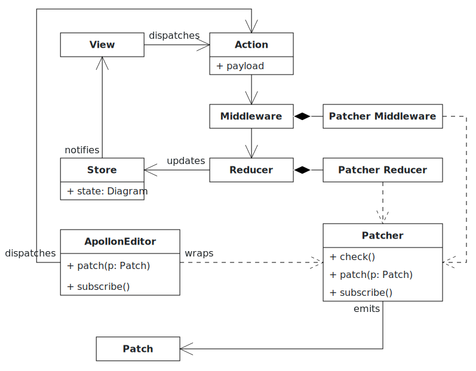

####################
Realtime Collaboration
####################

Apollon supports realtime collaboration by tracking and emitting patches when changes happen to the diagram. The patches are in the format of `RFC 6902`_ standard (i.e. `JSON Patch`_), so that they can be applied to Apollon diagrams by cliients in different languages and in various stacks (i.e. other clients, on the server, etc.).

Tracking changes happens through the `patcher service <Patcher Service Code_>`_. This service is written in a general form and then configured for the specific case of Apollon diagrams: the core of the service is the `Patcher <Patcher Code_>`_ class, which tracks changes to a given object and notifies subscribers to those changes, and allows applying patches, which might have been generated by other clients and received via the network, to said object. The `Patcher` is connected to Apollon's application state using the a `Redux Middleware`_ called `PatcherMiddleware <Patcher Middleware Code_>`_, which filters all incoming actions according to a given
configuration and asks the `Patcher` to check for changes when necessary, and a `Redux Reducer`_ called `PatcherReducer <Patcher Reducer Code_>`_, which is responsible for applying patches to the application state using the `Patcher <Patcher Code_>`_.

   Flow of Realtime Collaboration in Apollon

**********************
Diagram Schema Guidelines
**********************

The realtime collaboration system imposes some constraints on the schema of Apollon diagrams in order to be able to properly reconcile potentially conflicting changes between clients while sticking to the standard `JSON Patch`_ format. The constraints should be considered specifically when adding new diagram types.

Follow these guidelines to ensure any diagram type works properly with realtime collaboration:

- Use maps instead of arrays as much as possible. If you have a list of items with unique IDs, use a map with the keys set as said IDs to the each item, instead of an array.
- For representing sets of unique IDs, use maps mapping IDs to boolean values (i.e. inclusion maps), instead of arrays.

Dont't do this:

.. code-block:: typescript

  {
    "items": [
      { "id": "1", "name": "Item 1" },
      { "id": "2", "name": "Item 2" }
    ],
    "related": ["1", "2"]
  }

Do this instead:

.. code-block:: typescript

  {
    "items": {
      "1": { "name": "Item 1" },
      "2": { "name": "Item 2" }
    },
    "related": {
      "1": true,
      "2": true
    }
  }

In scenarios where you need to represent a list of items with an array, for example because the items cannot meaningfully be identified by unique IDs, you need to instruct the `Patcher <Patcher Code_>`_ to treat these arrays as `atomic values`, so that it ignores changes within the array and records the whole array as changed in emitted patches. The `Patcher <Patcher Code_>`_ accepts a `compare` function for this purpose, which will produce a `JSON Patch`_ given two objects. It is recommended to update the `default compare function <Patcher Compare Code_>`_ to account of any such schema change you might need to make. The default function already treats relationship paths as atomic arrays, which serves as an example.

**********************
Stuttering Prevention
**********************

The `Patcher <Patcher Code_>`_ also utilises a stuttering prevention mechanism to avoid applying patches that are optimistically predicted to be redundant. To this end, the `Patch Verifier <Patch Verifier Code_>`_ class is used to sign all patches created locally and record their corresponding path in the `JSON Patch`. The client assumes that the integrating platform will resend this patch to all clients, including the one that created it, and so will ignore other incoming patches on the same path until the self-signed patch is received, as such patches would be overriden by the self-signed patch anyway.

.. _RFC 6902: https://tools.ietf.org/html/rfc6902
.. _JSON Patch: http://jsonpatch.com/
.. _Redux Middleware: https://redux.js.org/understanding/history-and-design/middleware
.. _Redux Reducer: https://redux.js.org/faq/reducers
.. _Patcher Service Code: https://github.com/ls1intum/Apollon/tree/develop/src/main/services/patcher
.. _Patcher Code: https://github.com/ls1intum/Apollon/blob/develop/src/main/services/patcher/patcher.ts
.. _Patcher Compare Code: https://github.com/ls1intum/Apollon/blob/develop/src/main/services/patcher/compare.ts
.. _Patcher Middleware Code: https://github.com/ls1intum/Apollon/blob/develop/src/main/services/patcher/patcher-middleware.ts
.. _Patcher Reducer Code: https://github.com/ls1intum/Apollon/blob/develop/src/main/services/patcher/patcher-reducer.ts
.. _Patch Verifier Code: https://github.com/ls1intum/Apollon/blob/develop/src/main/services/patcher/patch-verifier.ts